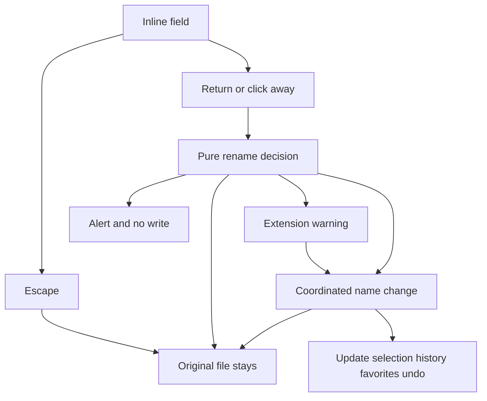

# Tek öğe Rename

Onaylarsan uygulama bu dilimle sınırlı kalır. Tahmini süre: yarım gün.

## Kilitli kararlar

- Bu dilim: tek öğe, satır içi Rename.
- Return yazar, Escape vazgeçer, başka yere tıklamak geçerli yeni adı yazar.

## Sonraki dilimler

Bu dört iş kararlaştırıldı. Bu planda kodlanmaz. Sıra, bir sonrakinin bu dilimde kurulan satır içi Rename’e dayanmasıyla başlar.

1. **New Folder** (Shift-Command-N). Açık klasörde `untitled folder`, ad doluysa `untitled folder 2` oluşturur. Sonra bu dilimdeki satır içi Rename başlar. Üzerine yazmaz.
2. **Move to Trash** (Command-Delete). `FileManager.trashItem`. Undo öğeyi geri koyar. Çöpü Boşalt yok. `removeItem` yok.
3. **Copy, Paste, Move Item Here.** Command-C dosya URL’lerini kopyalar. Command-V açık klasöre kopyalar, kaynak yerinde kalır. Option-Command-V taşır. Command-X yok; Finder dosyayı kesmez.
4. **Sürükle-bırak.** Aynı disk taşır, başka disk kopyalar, Option kopyalar.

3 ve 4 aynı ada çarpınca Finder diyalogu: Stop, Keep Both, Replace. Replace onaylıdır; sessiz silme yok.

Kararlaştırılıp yol haritasından çıkarılanlar: Duplicate, Batch Rename, Compress, Make Alias.

## Finder davranışı

Rename, listede veya yan çubukta seçili tek öğeye uygulanır. Seçim boşken açık klasörün adı değişmez.

Başlatma:

- Sağ tık **Rename** (tek URL, kayıp favori hariç).
- Odaktaki panoda Return.
- Zaten seçili adın üzerine, çift tıklama aralığından sonra gelen tek tık. Çift tıklama bugünkü gibi açmaya devam eder.

Alan, dosyada son uzantıdan önceki kısmı seçer (`file.tar.gz` içinde `file.tar`). Klasörde ve `.gitignore` gibi tek noktalı gizli adlarda adın tamamı seçilir.

Yazmadan önce karar veren saf fonksiyon:

- Aynı ad: disk işlemi yok.
- Boş ad: eski ada döner, disk işlemi yok.
- `.`, `..`, 255 bayttan uzun ad, `/` veya `:` : uyarı, dosya yerinde kalır. `/` ve `:` alana yazılmaz.
- Başka bir öğenin adı (büyük/küçük harf, diskin kendi kuralına göre): “The name is already taken.” Dosyanın üzerine yazılmaz, alan açık kalır.
- Dosya veya pakette uzantı değişirse: **Keep .ext** / **Use .ext**. Klasörde bu uyarı yok.

Yazma: `NSFileCoordinator` ile `URLResourceValues.name`. Geçici ada taşıma yok. Symlink ve Finder alias’ın kendisi değişir, hedefi değişmez. Hata olursa uyarı çıkar, baytlar eski yolda kalır.

Başarıdan sonra:

- Liste seçimi ve Quick Look yeni URL’ye geçer.
- Açık klasör, geri/ileri yığını ve `expanded` kümesi, değişen klasörün kendisi ya da altıysa yeni yola çekilir.
- Favori anahtarları aynı kural ile güncellenir ([Favorites.swift](Macxplorer/Models/Favorites.swift) yolu, symlink çözmeden).
- Undo Rename ters işlemi yapar. Eski ad doluysa üzerine yazmaz, uyarı verir.

## Nereye bağlanır

- Menü: [ItemContextMenu.swift](Macxplorer/Views/ItemContextMenu.swift) içine **Rename**, Quick Look ile aynı kural (`urls.count == 1`). `ItemActions` bir `rename: (URL) -> Void` alır.
- Liste alanı: [FileListView.swift](Macxplorer/Views/FileListView.swift) `nameCell`. Mevcut `RowDoubleClickCatcher` açmayı korur.
- Yan çubuk alanı: [SidebarTreeView.swift](Macxplorer/Views/SidebarTreeView.swift) satır adı. Kayıp favoride menü öğesi kapalı.
- Uyarı: [ContentView.swift](Macxplorer/ContentView.swift) satır 56’daki tek başlıklı Terminal uyarısı, başlık taşıyan ortak bir uyarıya döner. Uzantı onayı ayrı, iki düğmeli uyarıdır.
- Return, global kısayol olmaz. Yalnızca odaktaki liste veya yan çubuk yakalar. Metin alanındayken Return yazar.

## Dosyalar

- Yeni saf model: önerilen ad, seçim aralığı, uzantı kararı, yol öneki güncellemesi. Testler `MacxplorerTests` içinde, diske yazmadan.
- Yeni servis: koordineli ad değişimi. Geçici klasör testleri: başarılı ad, çakışmada yerinde kalma, yalnızca harf değişimi, symlink’in hedefini değiştirmeme, ikinci adım gerekirse eski ada dönme.
- [BrowserModel.swift](Macxplorer/ViewModels/BrowserModel.swift): başarıdan sonra seçili URL, `expanded` ve listeyi yenileme.
- [NavigationHistory.swift](Macxplorer/Models/NavigationHistory.swift): yığınlardaki klasör URL’lerini güncelleme.
