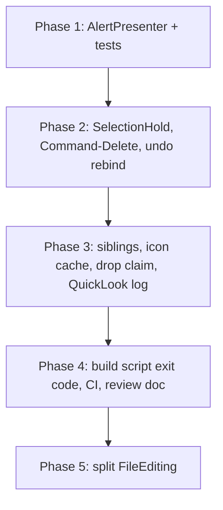

# Fix plan: verified audit findings in MacXplorer (revision 2)

## What changed in revision 2

I re-read every cited line, and a fresh-context adversarial reviewer checked each finding and each fix on its own. The first revision had these errors:

- **F1 was overstated.** The flag is cleared. The transfer path always awaits after it changes `selectedURL` (`listedMatches` waits on `detailTask`), so SwiftUI runs the `onChange` and `consumeRenameNavigation()` clears the flag. The data-loss scenario I described does not happen. The design is still fragile because a bare `Bool` does not record which folder it was armed for. F1 is now a hardening item.
- **F2's first fix would have deadlocked.** The first `AlertPresenter` stored one `waiter` continuation. A second queued alert overwrote it, and `finish` never resumed a waiter while the queue was non-empty, which recreates the hang F2 describes. Revision 2 gives each queued entry its own continuation.
- **F3 was false.** The `exists` and `trash` calls already run inside the `NSFileCoordinator` closures (`FileTransfer.swift` lines 86-96 and 107-116). The proposed fix changed nothing. Dropped.
- **F5's race claim was false.** `IconStore` is `@MainActor`. SwiftUI can only render between iterations at `await Task.yield()`, when the cache is consistent. The unbounded growth is real. The staging fix is dropped.
- **F6 was false.** `UserDefaults.set` updates memory and cfprefsd persists later, so it does not block on disk. A debounce would lose the last folder on a crash. Dropped.
- **Two `.alert` modifiers on one view work on macOS 12 and later.** I dropped that claim. The extension prompt keeps its own `.alert`.
- **F11's fix used an API that does not exist.** `DropInfo` exposes no drag session identity. Revision 2 uses `NSPasteboard(name: .drag).changeCount`, read synchronously at the top of `performDrop`.
- **F12's fix did not match the SDK.** Swift imports `QLPreviewView(frame:style:)` as returning an optional, so the property stays optional. The fix is now a log line.
- **Three nits were wrong.** `keepBothName` always stops, because `existing` is a finite array. The nested `Task { @MainActor in beginRename(folder) }` in `createNewFolder` is probably intentional: it waits one main-actor turn so the new row exists before the rename field opens. Keep it. `fatalError` in `init(coder:)` is the standard pattern.
- **Missing from revision 1:** undo can stay unbound for the whole session, the Delete key rule does not match what you expect, CI needs Xcode 27, and the plan had no commit or verification rules. All four are added below.
- **Project fact that makes this smaller:** the Xcode project uses file-system synchronized groups (`PBXFileSystemSynchronizedRootGroup`, objectVersion 77). New `.swift` files are picked up automatically, so no step edits `project.pbxproj`.

## Part 1: Findings

Each finding is marked **Confirmed** (real as described), **Hardening** (not a live bug, but fragile), or **Dropped** (wrong).

### F2. A second alert write hangs the transfer for the rest of the session (Confirmed, High)

`[Macxplorer/Editing/FileEditing.swift](Macxplorer/Editing/FileEditing.swift)` has one `actionAlert` slot. `askTransferChoice` (lines 442-457) suspends the transfer loop on a continuation that only the collision alert's buttons resume. Nothing stops another write while that alert is showing. These paths can write it:

- a `moveToTrash` Task that was already running and then fails (line 161)
- New Folder (Command-Shift-N) failing (line 191). The menu item does not check `isTransferring`.
- Undo (Command-Z) of a transfer or trash that fails (lines 300-302 and 475)
- the `openInTerminal` completion handler (`[Macxplorer/ContentView.swift](Macxplorer/ContentView.swift)` lines 344-348), which can arrive at any time

When one of these replaces the collision alert, `TransferChoiceGate` is never resumed and the `while let item = pending.first` loop never continues. `isTransferring` stays `true`, so paste and drop stay disabled until the app quits, with no message.

The `actionAlertIsPresented` setter (ContentView lines 302-311) also sets the alert to `nil` without resuming the gate, so any dismissal that skips a button hangs the transfer the same way.

### F1. The selection hold does not record which folder it was armed for (Hardening, Medium)

`[Macxplorer/ViewModels/BrowserModel.swift](Macxplorer/ViewModels/BrowserModel.swift)` line 35 keeps `preservesSelectionForRename: Bool`. Two callers set it: `holdListSelectionAcrossNavigation()` from a transfer (FileEditing line 387) and `applyRenamedItem`. It is cleared by `consumeRenameNavigation()`, which is only called from a view `onChange` (ContentView line 22), and by a conditional reset at line 263. Today every path does clear it. But the flag carries no destination, so any future path that sets it without a following `selectedURL` change would skip the selection clear on some unrelated later navigation. A stale selection on screen can then be trashed. Keying the hold to the destination folder closes that door.

### N1. Undo may never be installed (Confirmed risk, Medium, new)

`ContentView` calls `editing.bind(model:undoManager:)` once, in `onAppear` (line 18). If `@Environment(\.undoManager)` is `nil` or changes after that, `MainActorUndo.register` returns early on every registration (`[Macxplorer/Views/InlineRenameField.swift](Macxplorer/Views/InlineRenameField.swift)` line 278), and undo does nothing for the whole session. Whether it is `nil` at `onAppear` has not been observed yet. The fix is cheap either way.

### N2. The Delete key rule does not match what you expect (Confirmed, Medium, new)

`TrashShortcut.matches` (InlineRenameField.swift lines 306-309) removes Command and Caps Lock and then checks that no modifiers are left. So plain Delete, Forward Delete, and Command-Delete all match, in both `FileListView` (line 104) and `SidebarTreeView` (line 70). The earlier trash plan asked for exactly that (`move_to_trash_3285d831.plan.md` line 28).

You report that plain Delete does nothing in the app, like Finder. So the code and the app disagree. The likely reason, not yet verified, is that the table uses the plain Delete key before SwiftUI's `onKeyPress` sees it. The risk is that a focus change, an SDK update, or the sidebar lets the handler run, and then plain Delete starts moving items to the Trash with no code change. You want Finder behavior, so the rule should require Command.

### F4. Sidebar rename checks names against an empty list (Confirmed, Low)

`siblingNames(for:model:)` (FileEditing lines 547-550) returns `[]` when the item is not in `model.entries`. Renaming from the sidebar usually hits that, so the inline "name taken" check never fails. `FileRename` still catches the collision, so the user sees the same alert after a disk attempt instead of before. It is a small UX difference, not data loss.

### F5. The icon cache never evicts (Confirmed, Low)

`[Macxplorer/Services/IconStore.swift](Macxplorer/Services/IconStore.swift)` line 30 adds one `NSImage` per path ever shown and never removes any. There is no race (see the revision notes).

### F11. The nested-drop dedupe is timing-based (Confirmed, Low)

`[Macxplorer/Views/FileDrop.swift](Macxplorer/Views/FileDrop.swift)` line 169 needs `DropClaim` because each drop reaches several nested `.onDrop` delegates, for example a row and the table in `FileListView` lines 110 and 134. The dedupe uses a 400 ms window, so a second real drop inside that window returns `true` and writes nothing. People rarely drop twice that fast, but a timing rule is the wrong key when a real identity exists.

### F12. The preview goes blank with no log (Confirmed, Nit)

`[Macxplorer/Views/PreviewInspector.swift](Macxplorer/Views/PreviewInspector.swift)` lines 92-96: if `QLPreviewView` returns `nil`, the inspector is blank and nothing is logged.

### F7. `docs/code-review.md` reports wrong numbers (Confirmed, Low)

Line 53 says `BrowserModel.swift` has 205 lines, the sources are under 800 lines, and there are 5 tests. Now `BrowserModel.swift` has 535 lines, `Macxplorer/` has about 5,400 lines, and there are 117 test methods. Any count written into a doc will go stale again.

### F13. A failed build reports success, and a release can ship an old binary (Confirmed, High, found while building Phase 1)

`[scripts/build.sh](scripts/build.sh)` line 66 pipes `xcodebuild` through `grep -v` and ends with `|| true`. That throws away the `xcodebuild` exit status. Line 73 then treats the build as a success if `Build/Products/<config>/Macxplorer.app` exists, and that folder is still there from the last good build. While building Phase 1, a sandbox error made `xcodebuild` print `** BUILD FAILED **`, and the script still printed "✅ Build completed successfully!" and exited 0.

Every target that builds goes through this script:

- `make run` (`run.sh` line 57) launches the old app without saying so.
- `make install` (`install.sh` line 58) copies the old app into `/Applications`.
- `make package` (`package.sh` line 58) zips the old app.
- `make release-*` (`release.sh` line 330 calls `package.sh`) bumps the version, tags, and publishes a GitHub Release holding the previous build under the new version number.

[AGENTS.md](AGENTS.md) says a task is done when the `make` process exits 0, so an agent that follows the repo rules is told a failed build worked.

The `|| true` is there for a reason: with `set -o pipefail`, `grep -v` exits 1 when it has nothing to print, and a clean `-quiet` build prints nothing. So removing `|| true` alone would make every successful quiet build fail.

### F8 and F9. No CI, and no tests on the stateful code (Confirmed, Medium)

**F8 dropped by the user:** CI is not wanted. Tests keep running locally with the `xcodebuild … test` command in AGENTS.md. F9 is covered by the tests added in Phases 1 to 3.

There is no `.github/` directory. All 117 tests cover pure functions. Nothing tests `BrowserModel`, `FileEditing`, or alert handling, which is where F2 lives.

### F10. `FileEditing` has five jobs (Confirmed, structure only)

It is 619 lines covering rename, trash, transfer, undo wiring, and alerts. The undo relays sit in a Views file (`InlineRenameField.swift` lines 270-365). The `@unchecked Sendable` `Outcome` box is copied four times, in `FileRename`, `FileTrash`, `NewFolder`, and `FileTransfer`.

### Dropped

- **F3** (transfer check-then-trash). It already runs inside the coordinator. Other processes that do not coordinate can still race it, but then the replaced item goes to the Trash and undo restores it, so nothing is lost. Accepted.
- **F6** (UserDefaults write on each navigation). The write does not block.
- **Nits:** the `keepBothName` bound, `fatalError` in `init(coder:)`, removing the nested `Task` in `createNewFolder` (intentional), and caching path-bar text widths (about 10 measurements, negligible).
- **The root `DerivedData/` folder** is a real stray copy (the scripts use `.build/DerivedData`) and is gitignored. Deleting it needs your OK, so it is not a task here.

## Part 2: Solutions

Rules for every phase:

- Follow [AGENTS.md](AGENTS.md). One Conventional Commit per phase, for example `fix(alerts): queue alerts so a transfer never hangs`. Do not edit `CHANGELOG.md`, `MARKETING_VERSION`, or `CURRENT_PROJECT_VERSION`. The release target owns those.
- A phase is done when `make build` exits 0 and this command reports 0 failures:

```bash
xcodebuild -project Macxplorer.xcodeproj -scheme Macxplorer -destination 'platform=macOS' -derivedDataPath .build/DerivedData test CODE_SIGNING_ALLOWED=NO
```

### Phase 1: alert queue (F2, part of F9), about 1.5 h

New file `[Macxplorer/Editing/AlertPresenter.swift](Macxplorer/Editing/AlertPresenter.swift)`:

```swift
@MainActor
@Observable
final class AlertPresenter {
    private(set) var current: ActionAlert?
    @ObservationIgnored private var pending: [Entry] = []
    @ObservationIgnored private var active: Entry?

    private struct Entry {
        let alert: ActionAlert
        let resume: ((TransferChoice) -> Void)?
    }

    func show(_ alert: ActionAlert) {
        enqueue(Entry(alert: alert, resume: nil))
    }

    func ask(_ alert: ActionAlert) async -> TransferChoice {
        await withCheckedContinuation { continuation in
            enqueue(Entry(alert: alert, resume: { continuation.resume(returning: $0) }))
        }
    }

    /// Dismissal without a button counts as Stop, so a waiting transfer always resumes.
    func finish(_ id: ActionAlert.ID, choice: TransferChoice = .stop) {
        guard let entry = active, entry.alert.id == id else { return }
        active = nil
        current = nil
        entry.resume?(choice)
        Task { @MainActor in self.advance() }
    }

    private func enqueue(_ entry: Entry) {
        pending.append(entry)
        advance()
    }

    private func advance() {
        guard active == nil, !pending.isEmpty else { return }
        let next = pending.removeFirst()
        active = next
        current = next.alert
    }
}
```

Why it looks like this:

- Each entry owns its own continuation, and `finish` resumes the entry it removes. No continuation can be overwritten or skipped.
- `finish` ignores an `id` that is not the active alert. A button action and the `isPresented` setter both call `finish` for the same alert, and the second call is a no-op instead of finishing the next alert.
- `advance()` after `finish` waits one main-actor turn, so SwiftUI sees the dismissal before the next alert appears. Without that, the binding stays `true` and the next alert may never show.
- `show` does not wait, so the trash and new-folder error paths keep their current flow.

Changes:

1. `ActionAlert.Kind` becomes a plain enum, `.acknowledge` or `.collision`, with no closure. Delete `TransferChoiceGate`.
2. `FileEditing` owns `let alerts = AlertPresenter()`. Each `actionAlert = ActionAlert(...)` becomes `alerts.show(...)`, and `askTransferChoice` becomes `await alerts.ask(...)`. Delete the `actionAlert` property.
3. In `ContentView`, bind the one action alert with the `presenting:` overload of `.alert`. The buttons call `editing.alerts.finish(alert.id, choice:)`, and the `isPresented` setter calls `finish(id)` on dismissal. Keep the rename-refocus logic in the OK button, where it is today (lines 121-125). Route the `openInTerminal` failure through `editing.alerts.show`.
4. The extension prompt keeps its own `.alert`. It opens only from a rename commit and never waits on a continuation.
5. New `MacxplorerTests/AlertPresenterTests.swift`, `@MainActor`, async:
   - With two `ask` calls pending, finishing the first returns its choice, and the second becomes `current` after one yield.
   - Finishing with no choice returns `.stop`.
   - Finishing an old `id` changes nothing.
   - A `show` queued behind an `ask` waits its turn.

Manual check, about 3 minutes: copy 3 files into a folder that already has all 3 names, press Command-Shift-N while the first collision alert is open, and answer each alert. The transfer finishes, and paste still works afterwards.

### Phase 2: hold, Delete key, undo (F1, N2, N1, part of F9), about 45 min

**F1.** New pure type in `[Macxplorer/Models/SelectionHold.swift](Macxplorer/Models/SelectionHold.swift)`:

```swift
struct SelectionHold: Equatable {
    private(set) var target: String?

    mutating func arm(for url: URL) {
        target = url.directoryKey.path
    }

    /// Always disarms. Holds only when `url` is the folder the hold was armed for.
    mutating func consume(for url: URL?) -> Bool {
        defer { target = nil }
        guard let target, let url else { return false }
        return target == url.directoryKey.path
    }
}
```

- In `BrowserModel`, replace the `Bool` with `private var selectionHold = SelectionHold()`.
- `holdListSelectionAcrossNavigation()` becomes `holdListSelection(across destination: URL)` and calls `arm(for: destination)`. Update the caller at FileEditing line 387.
- In `applyRenamedItem`, arm only inside the branch where `selectedURL` actually changes, for the updated URL. Then delete the reset at lines 262-264, because a hold is never armed when nothing moves.
- `consumeRenameNavigation()` becomes `consumeSelectionHold(for:)`. ContentView line 21 passes the new value: `.onChange(of: model.selectedURL) { _, newURL in ... }`.
- New `MacxplorerTests/SelectionHoldTests.swift`: a hold armed for A holds for A; a hold armed for A does not hold for B; consuming always disarms; an unarmed hold never holds.

**N2.** Change `TrashShortcut.matches` to `modifiers.subtracting(.capsLock) == .command`. Keep both keys, so Command-Delete and Command-Forward Delete trash, and plain Delete does nothing. New `MacxplorerTests/TrashShortcutTests.swift`: no modifiers gives false, Command gives true, Command with Caps Lock gives true, Command-Shift gives false.

**N1.** In ContentView, add `.onChange(of: undoManager.map(ObjectIdentifier.init)) { _, _ in editing.bind(model: model, undoManager: undoManager) }`. Undo steps registered on an old manager are lost, and that is fine.

Manual check, about 2 minutes: rename a file and press Command-Z, and the old name comes back. Select a file and press plain Delete, and nothing happens. Press Command-Delete, and the file goes to the Trash.

**Found while testing Phase 2 by hand** (confirmed with temporary logging, which was removed before commit):

- **Delete keys carry the Function flag.** Delete and Forward Delete both arrive with `.function` set (Command-Delete logged `modifiers=80`, which is Command plus Function). The old check never removed `.function`, so the keyboard Trash shortcut never worked, even with Command. `TrashShortcut.matches` now ignores `.capsLock`, `.function`, and `.numericPad`, and a test covers it.
- **The sidebar never got keyboard focus.** Since `e155532`, a drag layer on each sidebar folder row took every click without focusing the sidebar list. So the selection was gray, and Return and Command-Delete never reached the sidebar handlers. `RenameClickView.mouseDown` now makes the table under it the first responder.
- **The rename field dropped its first focus request in the sidebar.** When Return opened the field, the first `focused = true` did nothing and a second request one step later worked. `focusSelectingName` now asks again once if the first request didn't take.

### Phase 3: small correctness fixes (F4, F5, F11, F12), about 1 h

- **F4.** When the item is not in `model.entries`, `siblingNames(for:model:)` returns `siblingNames(in: url.deletingLastPathComponent())`. That is one directory read on the main actor, the same as the existing transfer path at line 553.
- **F5.** Make `IconStore.cache` an `NSCache<NSString, NSImage>` with `countLimit = 5000`. `image(for:)` and `prefetch` keep their signatures. As built: a plain limit would leave an evicted icon as a placeholder until the next navigation, for example in a folder with more than 5000 items. So on a cache miss, `image(for:)` queues that URL, and one batched fetch runs a turn later. Only rows on screen ask, so the work stays small.
- **F11.** At the top of `performDrop`, before any `await`, read `let dragCount = NSPasteboard(name: .drag).changeCount`. `DropClaim.claim(dragCount:)` returns `false` only when that count was already claimed. The nested duplicate still returns `true`, because it is the same drop and it was already handled. Delete the time window.
- **F12.** In `QuickLookHost.init`, log with `appLogger.error` when `preview` is `nil`.

Manual check, about 2 minutes: drop one file on a folder row in the list, and it transfers once. Right away, drag a second file onto another folder, and it transfers too.

**Added while testing Phase 3 by hand** (requested by the user, shipped in the same commit):

- **Protected folders.** The home folder (shown as "Ev") could be renamed, trashed, and moved. So could `/`, `/Users`, other users' homes, and `Shared`. `Models/ProtectedFolders.swift` now covers `/`, the top-level system folders, every folder directly under `/Users`, and the standard folders in the home folder. Rename beeps, trash and move refuse with an alert, and copy still works. Folders inside them stay editable. `ProtectedFoldersTests` covers this.
- **Trash confirmation.** Command-Delete and the Move to Trash menu item now ask "Move “name” to the Trash?", or "Move N items…" for several items, every time. Move to Trash is the default button, and Escape cancels. It goes through the `AlertPresenter` queue as `Kind.confirmTrash`, using `confirm(_:) async -> Bool`.

### Phase 4: build script, CI, and the review doc (F13, F8, F7), about 1 h

**F13 comes first**, because CI and the release flow both rely on the build exit code. In `scripts/build.sh`:

1. Before `xcodebuild`, delete the old product: `rm -rf "$APP_PATH"`, after moving the `APP_PATH=` line above the build. Then a failed build can never leave a stale `.app` behind for the existence check.
2. Run the pipe with `set -e` turned off and read the `xcodebuild` status from `PIPESTATUS`, so `grep -v` printing nothing still counts as fine:

```bash
set +e
xcodebuild \
    ... \
    -quiet 2>&1 | grep -v -E "IDEDownloadableMetalToolchainCoordinator|IDESimulatorRuntimeVersionCoordinator|Operation not permitted|Supported platforms for the buildables|matching destinations"
BUILD_STATUS=${PIPESTATUS[0]}
set -e

if [ "$BUILD_STATUS" -ne 0 ]; then
    echo -e "${RED}❌ Build failed (xcodebuild exit $BUILD_STATUS)${NC}"
    exit "$BUILD_STATUS"
fi
```

3. Keep the `[ -d "$APP_PATH" ]` check after that as a second guard.

`run.sh`, `install.sh`, and `package.sh` all run under `set -e` and call `build.sh` directly, so they stop on the new non-zero exit with no changes of their own. Check that assumption on each file before relying on it.

Checks, about 5 minutes:

- `make build` on clean code exits 0 and prints the success line.
- Add a type error to any `.swift` file, and `make build` exits non-zero, prints `❌ Build failed`, and leaves no `Macxplorer.app` under `.build/DerivedData/Build/Products/Debug/`. Remove the error.
- With the same error in place, `make run` exits non-zero and does not open the app.
- `make release-dry-run` still works on clean code.

Commit this as its own `fix(scripts): fail the build when xcodebuild fails`.

**CI below is dropped** (the user does not want it). Only F13 and F7 remain in this phase.

**Added instead of CI:** `make tests` runs `scripts/test.sh`. It prints only errors, failures, and the test count, writes the full output to `.build/test.log`, and exits with xcodebuild's status. AGENTS.md now points to it. Commit it as `feat(scripts): add make tests`.

Before writing the workflow, check GitHub's runner-images list for an image that ships Xcode 27 with the macOS 26 SDK. The code needs `#available(macOS 26.0, *)` and `.sharedBackgroundVisibility`, so the older `macos-14` and `macos-15` images will not build it.

`.github/workflows/test.yml`:

```yaml
name: test
on:
  push:
    branches: [main]
  pull_request:
concurrency:
  group: test-${{ github.ref }}
  cancel-in-progress: true
jobs:
  test:
    runs-on: macos-26
    timeout-minutes: 30
    steps:
      - uses: actions/checkout@v4
      - run: sudo xcode-select -s /Applications/Xcode_27.0.app
      - run: xcodebuild -version
      - run: xcodebuild -project Macxplorer.xcodeproj -scheme Macxplorer -destination 'platform=macOS' -derivedDataPath .build/DerivedData test CODE_SIGNING_ALLOWED=NO
```

- The test target runs inside the app. GitHub macOS runners have a GUI session, so the app window can open. If the host app will not load with `CODE_SIGNING_ALLOWED=NO`, switch to ad-hoc signing: `CODE_SIGN_IDENTITY=- CODE_SIGNING_REQUIRED=NO`.
- macOS runner minutes cost about 10 times Linux minutes. The triggers are limited to pushes to `main` and pull requests, and a newer run cancels an older one.
- **F7.** Rewrite `docs/code-review.md` as this audit's resolution: each finding, its status, and where it was fixed. Leave out line counts and test counts so they cannot go stale. Mark the old four-click manual pass as still open unless you run it.

### Phase 5: split `FileEditing` (F10), about 2 h

This phase only moves code. Behavior does not change. It comes last so the moves happen after Phases 1 and 2 have settled that code.

- `Macxplorer/Editing/RenameCoordinator.swift`: `beginRename`, `commitRename`, `performRename`, `siblingNames`, `volumeIsCaseSensitive`
- `Macxplorer/Editing/TrashCoordinator.swift`: `moveToTrash`, `restoreTrashed`, `undoNewFolder`, `stillTheCreatedFolder`, `folderIdentity`
- `Macxplorer/Editing/TransferCoordinator.swift`: `transfer`, `writeTransfer`, `undoTransfer`, `undoTransferItem`, `restoreDisplaced`, `transferDestination`, `movedFolder`, `transferItemExists`
- `Macxplorer/Editing/UndoRelays.swift`: `MainActorUndo` and the four relays, moved unchanged from `InlineRenameField.swift` lines 270-365
- `Macxplorer/Services/CoordinatedOutcome.swift`: one `final class CoordinatedOutcome<Value>: @unchecked Sendable { var result: Result<Value, Error>? }`, replacing the four private `Outcome` classes

`FileEditing` stays the `@Observable` object the views bind to (`listSelection`, `renameSession`, `isTransferring`, `alerts`, `draft`) and forwards calls to the coordinators. The coordinators take `BrowserModel` and `AlertPresenter` in their initializers. Because of the synchronized groups, the new files need no project edits.

As built:
- The coordinators are small `@MainActor` structs that `FileEditing` creates on demand from its `model`, so there is no lifecycle to manage.
- They do the disk work and show their own alerts, then return a result: `TrashRun`, `TransferRun`, or a renamed `URL?`. `FileEditing` applies that result to the view state (selection, Quick Look, the rename session) and registers undo.
- `FolderNames` holds the shared sibling-name and case-sensitivity reads.
- `CreatedFolderIdentity.of(_:)` and `stillIdentifies(_:)` replace `folderIdentity` and `stillTheCreatedFolder`.
- `TrashShortcut` stays in `InlineRenameField.swift`, next to the key handling.

## Order



Total: about 6.5 hours. Phase 1 fixes the only bug that can currently strand a transfer. You can stop after any phase, because each one builds and passes the tests on its own.
