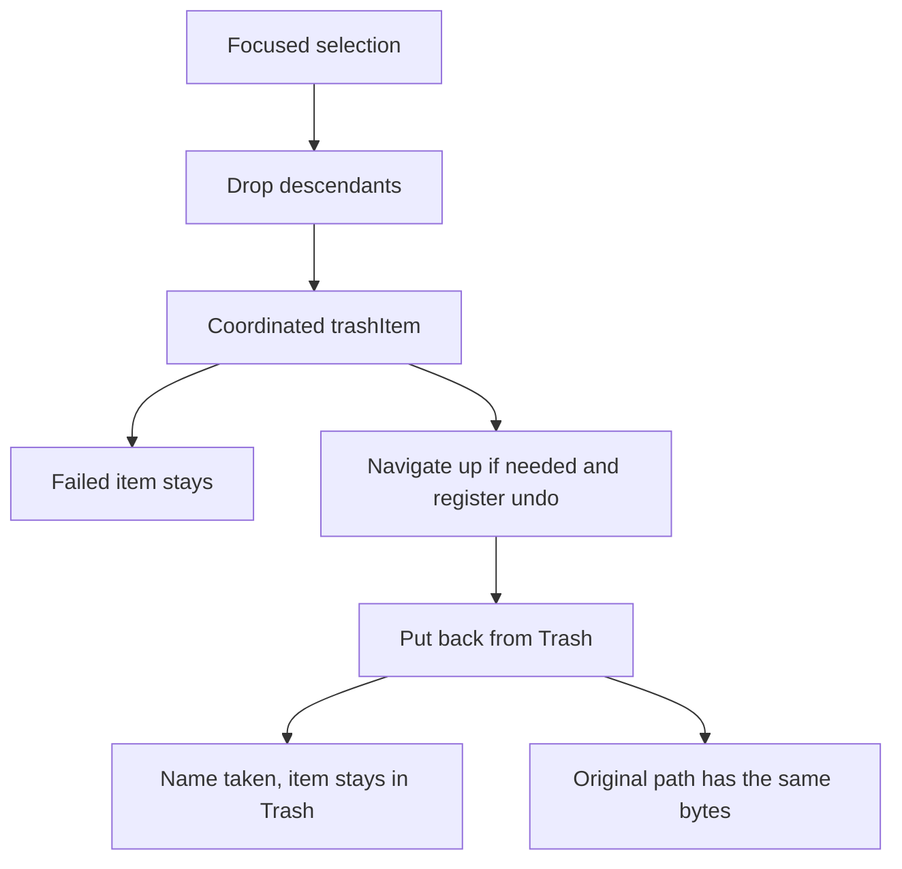

# Move to Trash

Bu dilim yalnızca Çöp’e taşıma. New Folder, Copy/Paste ve sürükle-bırak yazılmaz. Onay ve Çöpü Boşalt yok. `removeItem` yok.

## Finder davranışı

Hedef, odaktaki panonun seçimidir. Liste birden fazla öğe olabilir. Yan çubuk tek klasördür. Seçim boşken açık klasör çöpe gitmez. Kayıp favori çöpe gitmez. Rename alanı açıkken Delete adı siler, dosyayı değil.

Başlatma:

- Sağ tık **Move to Trash**. Kısayol Command-Delete.
- Odaktaki listede veya yan çubukta Delete, Forward Delete ve Command-Delete.

Bir klasör ile onun içindeki seçili öğe birlikteyse yalnızca ata çöpe gider. Symlink ve Finder alias’ın kendisi gider, hedefi kalır.

Başarısız öğe yerinde kalır. Başarılı olanlar Çöp’tedir. Uyarı, taşınamayanı söyler.

Açık klasör, çöpe giden klasörün kendisi ya da altıysa pencere o klasörün üstüne çıkar. Geri/ileri yığınındaki ve `expanded` içindeki o ağaç da oraya çekilir. Favori yolu durur; klasör geri gelince favori yine açılır.

Undo, Çöp’teki kopyayı eski yola koyar. Eski ad doluysa üzerine yazmaz, öğe Çöp’te kalır, uyarı çıkar.

## Yazma

Yeni servis, [FileRename.swift](Macxplorer/Services/FileRename.swift) ile aynı koordinasyon kalıbı: `NSFileCoordinator` seçeneği `.forDeleting`, sonra `FileManager.trashItem`. Dönüş, Çöp’teki URL’dir.

Geri koyma aynı koordinasyonla `moveItem` kullanır. Hedef varsa yazmaz.

Uygulama kodu `removeItem` çağırmaz. Test, çöpe giden geçici kopyayı yalnızca `tearDown` içinde temizler.

## Nereye bağlanır

- Menü: [ItemContextMenu.swift](Macxplorer/Views/ItemContextMenu.swift) içinde Rename’in altında **Move to Trash**. `ItemActions` bir `moveToTrash: ([URL]) -> Void` alır. Boş seçimde kapalı. Kayıp favoride kapalı.
- Klavye: [FileListView.swift](Macxplorer/Views/FileListView.swift) ve [SidebarTreeView.swift](Macxplorer/Views/SidebarTreeView.swift) üzerinde, Return ile aynı şekilde yalnızca o pane. Global kısayol yok.
- Durum: [BrowserModel.swift](Macxplorer/ViewModels/BrowserModel.swift) `applyRenamedItem` yanına, çöpe giden ağacı açık klasörden, yığından ve `expanded` kümesinden düşüren bir yöntem.
- Uyarı ve Undo: [ContentView.swift](Macxplorer/ContentView.swift) içindeki ortak uyarı ve `RenameUndoRelay` kalıbı. Eylem adı **Move to Trash**.

## Testler

- Saf fonksiyon: ata varken alt öğe liste dışı kalır. Komşu yol (`/Users/ab`, `/Users/a` çöpe gidince) durur.
- Geçici dosya gerçekten Çöp’e gider, eski yol kalmaz, baytlar Çöp URL’sindedir.
- Symlink çöpe gidince hedef dosya durur.
- Geri koyma baytları eski yola getirir. Eski ad doluysa yeni dosya değişmez, Çöp kopyası durur.
